---
## Front matter
lang: ru-RU
title: Лабораторная работа №2
subtitle: Дискреционное разграничение прав в Linux. Основные атрибуты 
author:
  - Чванова Ангелина Дмитриевна
institute:
  - Российский университет дружбы народов, Москва, Россия
date: 2024 год

babel-lang: russian
babel-otherlangs: english
mainfont: Arial
monofont: Courier New
fontsize: 12pt

## Formatting pdf
toc: false
toc-title: Содержание
slide_level: 2
aspectratio: 169
section-titles: true
theme: metropolis
header-includes:
 - \metroset{progressbar=frametitle,sectionpage=progressbar,numbering=fraction}
 - '\makeatletter'
 - '\beamer@ignorenonframefalse'
 - '\makeatother'
---
# Информация

## Докладчик

:::::::::::::: {.columns align=center}
::: {.column width="70%"}

  * Чванова Ангелина Дмитриевна
  * студент
  * Российский университет дружбы народов
  * [angelinachdm@gmail.com](mailto:angelinachdm@gmail.com)
  * <https://adchvanova-new.github.io/ru/>

:::
::: {.column width="30%"}

:::
::::::::::::::

# Цель работы

Получить практические навыки работы в консоли с атрибутами файлов, закрепить теоретические основы дискреционного разграничения доступа в современных системах с открытым кодом на базе ОС Linux
 
# Выполнение лабораторной работы

1. В установленной при выполнении предыдущей лабораторной работы операционной системе создайте учётную запись пользователя guest (использую учётную запись администратора):
useradd guest

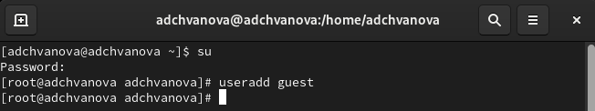{ #fig:001 width=70% height=70% }

# Выполнение лабораторной работы

2. Задайте пароль для пользователя guest (использую учётную запись администратора):
passwd guest

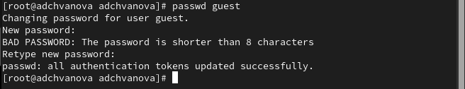{ #fig:002 width=70% height=70% }

# Выполнение лабораторной работы

3. Войдите в систему от имени пользователя guest.

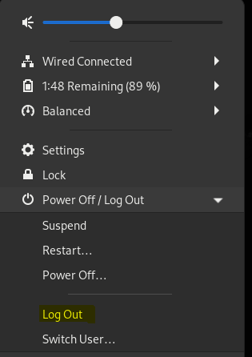{ #fig:003 width=70% height=70% }

# Выполнение лабораторной работы

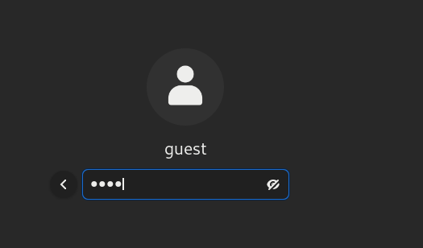{ #fig:004 width=70% height=70% }

# Выполнение лабораторной работы

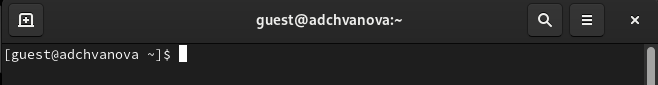{ #fig:005 width=70% height=70% }

# Выполнение лабораторной работы

4. Определите директорию, в которой вы находитесь, командой pwd. Сравните её с приглашением командной строки. Определите, является ли она вашей домашней директорией? Если нет, зайдите в домашнюю директорию.

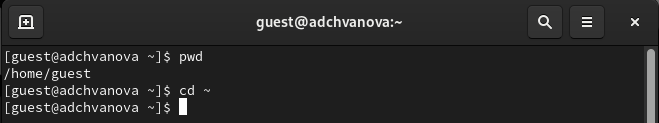{ #fig:006 width=70% height=70% }

# Выполнение лабораторной работы

5. Уточните имя вашего пользователя командой whoami.

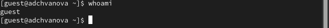{ #fig:007 width=70% height=70% }

# Выполнение лабораторной работы

6. Уточните имя вашего пользователя, его группу, а также группы, куда входит пользователь, командой id. Выведенные значения uid, gid и др. запомните. Сравните вывод id с выводом команды groups.

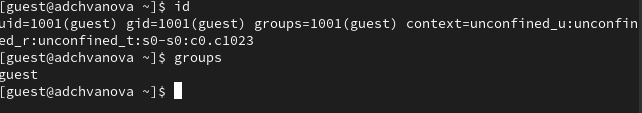{ #fig:008 width=70% height=70% }

# Выполнение лабораторной работы

7. Сравните полученную информацию об имени пользователя с данными, выводимыми в приглашении командной строки.

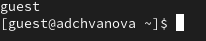{ #fig:009 width=70% height=70% }

# Выполнение лабораторной работы

8. Просмотрите файл /etc/passwd командой cat /etc/passwd
Найдите в нём свою учётную запись. Определите uid пользователя. Определите gid пользователя. Сравните найденные значения с полученными в предыдущих пунктах.

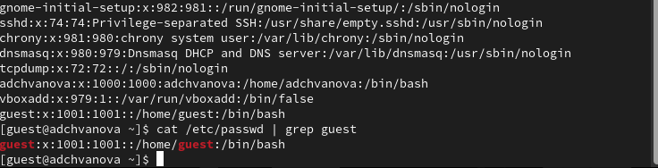{ #fig:010 width=70% height=70% }

# Выполнение лабораторной работы

9. Определите существующие в системе директории командой
ls -l /home/
Удалось ли вам получить список поддиректорий директории /home? Какие права установлены на директориях?

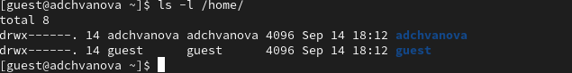{ #fig:011 width=70% height=70% }

# Выполнение лабораторной работы

10. Проверьте, какие расширенные атрибуты установлены на поддиректориях, находящихся в директории /home, командой:
lsattr /home
Удалось ли вам увидеть расширенные атрибуты директории?
Удалось ли вам увидеть расширенные атрибуты директорий других
пользователей?

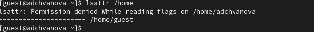{ #fig:012 width=70% height=70% }

# Выполнение лабораторной работы

11. Создайте в домашней директории поддиректорию dir1 командой
mkdir dir1
Определите командами ls -l и lsattr, какие права доступа и расширенные атрибуты были выставлены на директорию dir1.

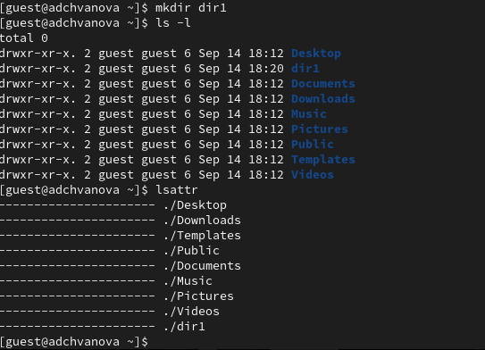{ #fig:013 width=70% height=70% }

# Выполнение лабораторной работы

12. Снимите с директории dir1 все атрибуты командой
chmod 000 dir1
и проверьте с её помощью правильность выполнения команды
ls -l

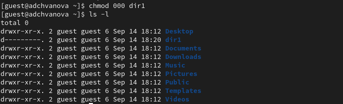{ #fig:014 width=70% height=70% }

# Выполнение лабораторной работы

13. Попытайтесь создать в директории dir1 файл file1 командой
echo "test" > /home/guest/dir1/file1
Объясните, почему вы получили отказ в выполнении операции по созданию файла?
Оцените, как сообщение об ошибке отразилось на создании файла? Проверьте командой
ls -l /home/guest/dir1
действительно ли файл file1 не находится внутри директории dir1.

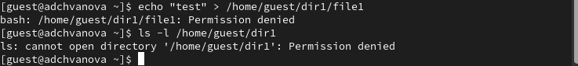{ #fig:015 width=70% height=70% }

# Выполнение лабораторной работы

## Заполнение таблицы 2.1

14. Заполните таблицу «Установленные права и разрешённые действия», выполняя действия от имени владельца директории (файлов), определив опытным путём, какие операции разрешены, а какие нет.

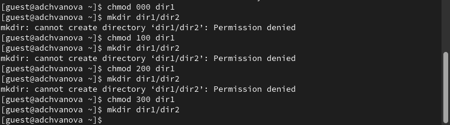{ #fig:017 width=70% height=70% }

# Вывод

Были получены практические навыки работы в консоли с атрибутами файлов, закреплены теоретические основы дискреционного разграничения доступа в современных системах с открытым кодом на базе ОС Linux

# Список литературы. Библиография

[1] Операционные системы: https://blog.skillfactory.ru/glossary/operaczionnaya-sistema/

[2] Права доступа: https://codechick.io/tutorials/unix-linux/unix-linux-permissions