---
## Front matter
lang: ru-RU
title: Лабораторная работа №5
subtitle: Дискреционное разграничение прав в Linux. Исследование влияния дополнительных атрибутов
author:
  - Чванова Ангелина Дмитриевна
institute:
  - Российский университет дружбы народов, Москва, Россия
date: 2024 год

babel-lang: russian
babel-otherlangs: english
mainfont: Arial
monofont: Courier New
fontsize: 12pt

## Formatting pdf
toc: false
toc-title: Содержание
slide_level: 2
aspectratio: 169
section-titles: true
theme: metropolis
header-includes:
 - \metroset{progressbar=frametitle,sectionpage=progressbar,numbering=fraction}
 - '\makeatletter'
 - '\beamer@ignorenonframefalse'
 - '\makeatother'
---
# Информация

## Докладчик

:::::::::::::: {.columns align=center}
::: {.column width="70%"}

  * Чванова Ангелина Дмитриевна
  * студент
  * Российский университет дружбы народов
  * [angelinachdm@gmail.com](mailto:angelinachdm@gmail.com)
  * <https://adchvanova-new.github.io/ru/>

:::
::: {.column width="30%"}

:::
::::::::::::::

# Цель работы

Изучение механизмов изменения идентификаторов, применения
SetUID- и Sticky-битов. Получение практических навыков работы в консоли с дополнительными атрибутами. Рассмотрение работы механизма смены идентификатора процессов пользователей, а также влияние бита Sticky на запись и удаление файлов

# Теоретическое введение

В Linux существует три основных вида прав — право на чтение (read), запись (write) и выполнение (execute), а также три категории пользователей, к которым они могут применяться — владелец файла (user), группа владельца (group) и все остальные (others). Но, кроме прав чтения, выполнения и записи, есть еще три дополнительных атрибута.

- Sticky bit Используется в основном для каталогов, чтобы защитить в них файлы. В такой каталог может писать любой пользователь. Но, из такой директории пользователь может удалить только те файлы, владельцем которых он является. Примером может служить директория /tmp, в которой запись открыта для всех пользователей, но нежелательно удаление чужих файлов. 

- SUID (Set User ID) Атрибут исполняемого файла, позволяющий запустить его с правами владельца. В Linux приложение запускается с правами пользователя, запустившего указанное приложение. Это обеспечивает дополнительную безопасность т.к. процесс с правами пользователя не сможет получить доступ к важным системным файлам, которые принадлежат пользователю root. SGID (Set Group ID). Аналогичен suid, но относиться к группе. 

# Выполнение лабораторной работы

## 5.2.1. Подготовка лабораторного стенда

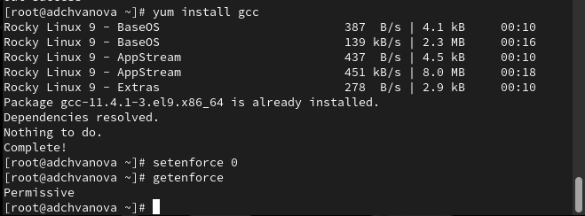{ #fig:001 width=70% height=70% }

# Выполнение лабораторной работы

## 5.3.1 Создание программы

Войдите в систему от имени пользователя guest. Создайте программу simpleid.c.

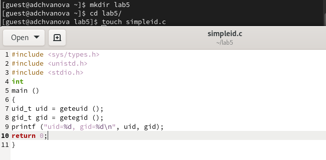{ #fig:002 width=70% height=70% }

# Выполнение лабораторной работы

Скомплилируйте программу и убедитесь, что файл программы создан. Выполните программу simpleid. Выполните системную программу id

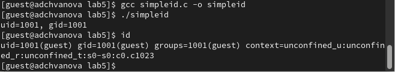{ #fig:003 width=70% height=70% }

# Выполнение лабораторной работы

 Усложните программу, добавив вывод действительных идентификаторов.

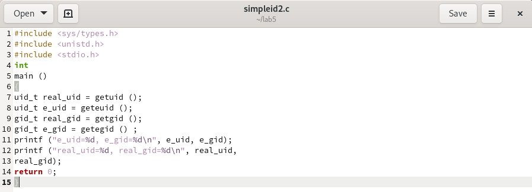{ #fig:004 width=70% height=70% }

# Выполнение лабораторной работы

Скомпилируйте и запустите simpleid2.c:
gcc simpleid2.c -o simpleid2
./simpleid2

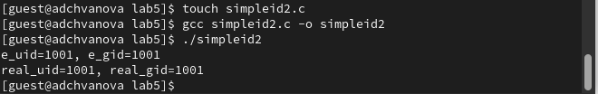{ #fig:005 width=70% height=70% }

# Выполнение лабораторной работы

От имени суперпользователя выполнила команды “sudo chown root:guest
/home/guest/simpleid2” и “sudo chmod u+s /home/guest/simpleid2”, затем выполнила проверку правильности установки новых атрибутов и смены владельца
файла simpleid2 командой “sudo ls -l /home/guest/simpleid2”. Этими командами была произведена смена пользователя файла на root и установлен SetUID-бит.
Выполните проверку правильности установки новых атрибутов и смены
владельца файла simpleid2

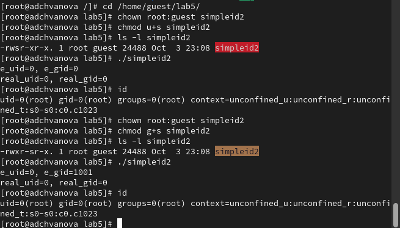{ #fig:006 width=70% height=70% }

# Выполнение лабораторной работы

Создайте программу readfile.c Откомпилируйте её.

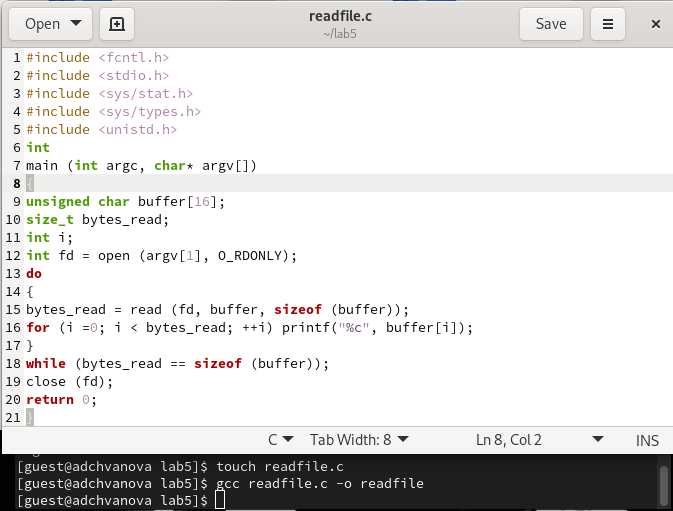{ #fig:007 width=70% height=70% }

# Выполнение лабораторной работы

Смените владельца у файла readfile.c (или любого другого текстового файла в системе) и измените права так, чтобы только суперпользователь (root) мог прочитать его, a guest не мог.

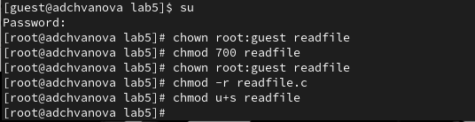{ #fig:008 width=70% height=70% }

# Выполнение лабораторной работы

Проверьте, что пользователь guest не может прочитать файл readfile.c. Смените у программы readfile владельца и установите SetU’D-бит.Проверьте, может ли программа readfile прочитать файл readfile.c?Проверьте, может ли программа readfile прочитать файл /etc/shadow? Отразите полученный результат и ваши объяснения в отчёте.

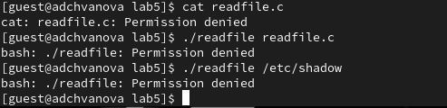{ #fig:009 width=70% height=70% }

# Выполнение лабораторной работы

От имени суперпользователя все команды удается выполнить.

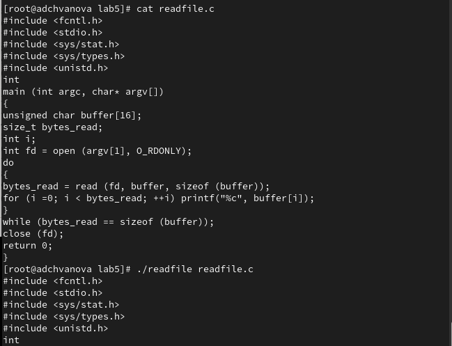{ #fig:010 width=70% height=70% }

# Выполнение лабораторной работы

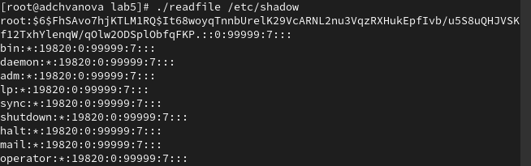{ #fig:011 width=70% height=70% }

# Выполнение лабораторной работы

## 5.3.2. Исследование Sticky-бита

Выясните, установлен ли атрибут Sticky на директории /tmp.От имени пользователя guest создайте файл file01.txt в директории /tmp
со словом test. Просмотрите атрибуты у только что созданного файла и разрешите чтение и запись для категории пользователей «все остальные»

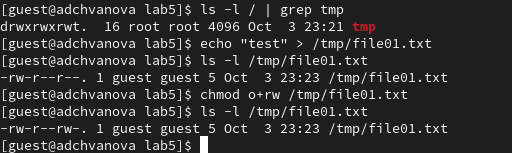{ #fig:012 width=70% height=70% }

# Выполнение лабораторной работы

От пользователя guest2 (не являющегося владельцем) попробуйте прочитать файл /tmp/file01.txt. От пользователя guest2 попробуйте дозаписать в файл. Проверьте содержимое файла командой. От пользователя guest2 попробуйте записать в файл /tmp/file01.txt слово test3, стерев при этом всю имеющуюся в файле информацию командой. От пользователя guest2 попробуйте удалить файл /tmp/file01.txt командой rm /tmp/fileOl.txt. От пользователя guest2 проверьте, что атрибута t у директории /tmp нет:

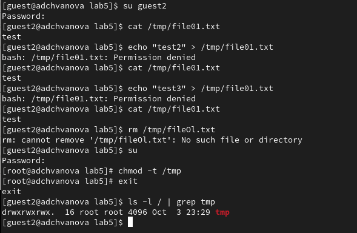{ #fig:013 width=70% height=70% }

# Выполнение лабораторной работы

Повторите предыдущие шаги. Какие наблюдаются изменения. Удалось ли вам удалить файл от имени пользователя, не являющегося его владельцем? Повысьте свои права до суперпользователя и верните атрибут t на директорию /tmp

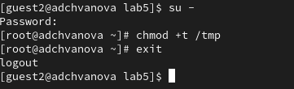{ #fig:014 width=70% height=70% }

# Вывод

Были изучены механизмы изменения идентификаторов и применения
SetUID- и Sticky-битов. Получены практические навыки работы в консоли с дополнительными атрибутами. Были рассмотрены работа механизма смены идентификатора процессов пользователей, а также влияние бита Sticky на запись и удаление файлов

# Список литературы. Библиография

[0] Методические материалы курса

[1] Дополнительные атрибуты: https://tokmakov.msk.ru/blog/item/141

[2] Компилятор GSS: http://parallel.imm.uran.ru/freesoft/make/instrum.html