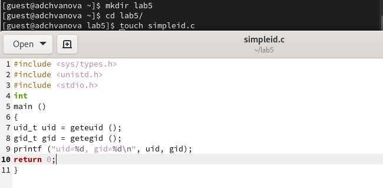
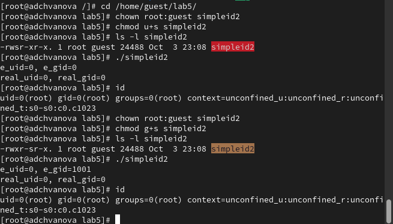
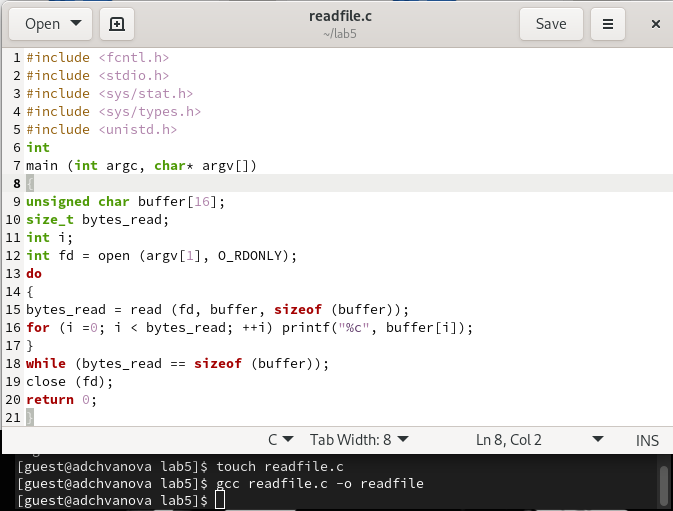
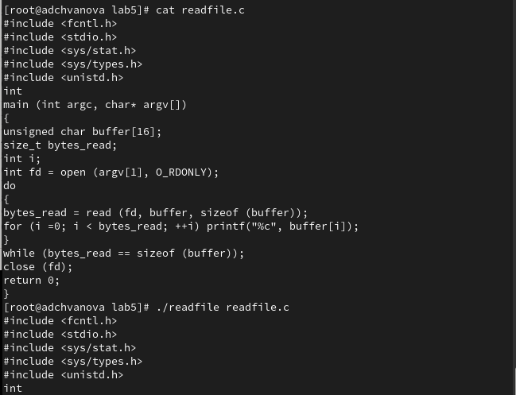
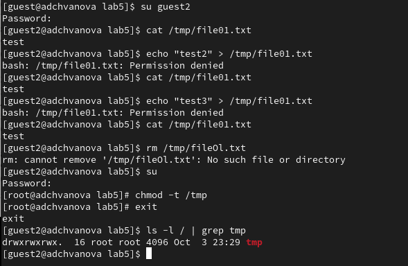

---
## Front matter
title: "Отчёт по лабораторной работе №5 Информационная безопасность"
subtitle: "Дискреционное разграничение прав в Linux. Исследование влияния дополнительных атрибутов"
author: "Выполнила: Чванова Ангелина, НПИбд-02-21 "

## Generic otions
lang: ru-RU
toc-title: "Содержание"

## Bibliography
bibliography: bib/cite.bib
csl: pandoc/csl/gost-r-7-0-5-2008-numeric.csl

## Pdf output format
toc: true # Table of contents
toc-depth: 2
lof: true # List of figures
fontsize: 12pt
linestretch: 1.5
papersize: a4
documentclass: scrreprt
## I18n polyglossia
polyglossia-lang:
  name: russian
  options:
	- spelling=modern
	- babelshorthands=true
polyglossia-otherlangs:
  name: english
## I18n babel
babel-lang: russian
babel-otherlangs: english
## Fonts
mainfont: PT Serif
romanfont: PT Serif
sansfont: PT Sans
monofont: PT Mono
mainfontoptions: Ligatures=TeX
romanfontoptions: Ligatures=TeX
sansfontoptions: Ligatures=TeX,Scale=MatchLowercase
monofontoptions: Scale=MatchLowercase,Scale=0.9
## Biblatex
biblatex: true
biblio-style: "gost-numeric"
biblatexoptions:
  - parentracker=true
  - backend=biber
  - hyperref=auto
  - language=auto
  - autolang=other*
  - citestyle=gost-numeric
## Pandoc-crossref LaTeX customization
figureTitle: "Рис."
tableTitle: "Таблица"
listingTitle: "Листинг"
lofTitle: "Список иллюстраций"
lolTitle: "Листинги"
## Misc options
indent: true
header-includes:
  - \usepackage{indentfirst}
  - \usepackage{float} # keep figures where there are in the text
  - \floatplacement{figure}{H} # keep figures where there are in the text
---

# Цель работы

Изучение механизмов изменения идентификаторов, применения
SetUID- и Sticky-битов. Получение практических навыков работы в консоли с дополнительными атрибутами. Рассмотрение работы механизма смены идентификатора процессов пользователей, а также влияние бита Sticky на запись и удаление файлов

# Теоретическое введение

**1. Дополнительные атрибуты файлов Linux** 

В Linux существует три основных вида прав — право на чтение (read), запись (write) и выполнение (execute), а также три категории пользователей, к которым они могут применяться — владелец файла (user), группа владельца (group) и все остальные (others). Но, кроме прав чтения, выполнения и записи, есть еще три дополнительных атрибута. [1]

- **Sticky bit**

Используется в основном для каталогов, чтобы защитить в них файлы. В такой каталог может писать любой пользователь. Но, из такой директории пользователь может удалить только те файлы, владельцем которых он является. Примером может служить директория /tmp, в которой запись открыта для всех пользователей, но нежелательно удаление чужих файлов. 

- **SUID (Set User ID)**

Атрибут исполняемого файла, позволяющий запустить его с правами владельца. В Linux приложение запускается с правами пользователя, запустившего указанное приложение. Это обеспечивает дополнительную безопасность т.к. процесс с правами пользователя не сможет получить доступ к важным системным файлам, которые принадлежат пользователю root. 

- **SGID (Set Group ID)**

Аналогичен suid, но относиться к группе. Если установить sgid для каталога, то все файлы созданные в нем, при запуске будут принимать идентификатор группы каталога, а не группы владельца, который создал файл в этом каталоге. 

- **Обозначение атрибутов sticky, suid, sgid**

Специальные права используются довольно редко, поэтому при выводе программы ls -l символ, обозначающий указанные атрибуты, закрывает символ стандартных прав доступа. 
 
Пример:

`rwsrwsrwt`

*где первая s — это suid, вторая s — это sgid, а последняя t — это sticky bit*

В приведенном примере не понятно, rwt — это rw- или rwx? Определить это просто. Если t маленькое, значит x установлен. Если T большое, значит x не установлен. То же самое правило распространяется и на s.

В числовом эквиваленте данные атрибуты определяются первым символом при четырехзначном обозначении (который часто опускается при назначении прав), например в правах 1777 — символ 1 обозначает sticky bit. Остальные атрибуты имеют следующие числовое соответствие:

    1 — установлен sticky bit
    2 — установлен sgid
    4 — установлен suid

**2. Компилятор GCC** 

GСС - это свободно доступный оптимизирующий компилятор для языков C, C++.
Собственно программа gcc это некоторая надстройка над группой компиляторов, которая способна анализировать имена файлов, передаваемые ей в качестве аргументов, и определять, какие действия необходимо выполнить. Файлы с расширением .cc или .C рассматриваются, как файлы на языке C++, файлы с расширением .c как программы на языке C, а файлы c расширением .o считаются объектными. [2]

# Выполнение лабораторной работы

## 5.2.1. Подготовка лабораторного стенда

{ #fig:001 width=70% height=70% }

## 5.3.1 Создание программы

1. Войдите в систему от имени пользователя guest.

2. Создайте программу simpleid.c.

{ #fig:002 width=70% height=70% }

3. Скомплилируйте программу и убедитесь, что файл программы создан:
gcc simpleid.c -o simpleid

4. Выполните программу simpleid:
./simpleid

5. Выполните системную программу id:
id
и сравните полученный вами результат с данными предыдущего пункта задания.

{ #fig:003 width=70% height=70% }

6. Усложните программу, добавив вывод действительных идентификаторов.

{ #fig:004 width=70% height=70% }

7. Скомпилируйте и запустите simpleid2.c:
gcc simpleid2.c -o simpleid2
./simpleid2

{ #fig:005 width=70% height=70% }

8. От имени суперпользователя выполните команды:
chown root:guest /home/guest/simpleid2
chmod u+s /home/guest/simpleid2

9. Используйте sudo или повысьте временно свои права с помощью su.
Поясните, что делают эти команды.

От имени суперпользователя выполнила команды “sudo chown root:guest
/home/guest/simpleid2” и “sudo chmod u+s /home/guest/simpleid2”, затем выполнила проверку правильности установки новых атрибутов и смены владельца
файла simpleid2 командой “sudo ls -l /home/guest/simpleid2” (рис. 3.9). Этими
командами была произведена смена пользователя файла на root и установлен
SetUID-бит.

10. Выполните проверку правильности установки новых атрибутов и смены
владельца файла simpleid2:
ls -l simpleid2

11. Запустите simpleid2 и id:
./simpleid2
id
Сравните результаты.

12. Проделайте тоже самое относительно SetGID-бита.

{ #fig:006 width=70% height=70% }

13. Создайте программу readfile.c

14. Откомпилируйте её.
gcc readfile.c -o readfile

{ #fig:007 width=70% height=70% }

15. Смените владельца у файла readfile.c (или любого другого текстового файла в системе) и измените права так, чтобы только суперпользователь (root) мог прочитать его, a guest не мог.

{ #fig:008 width=70% height=70% }

16. Проверьте, что пользователь guest не может прочитать файл readfile.c.

17. Смените у программы readfile владельца и установите SetU’D-бит.

18. Проверьте, может ли программа readfile прочитать файл readfile.c?

19. Проверьте, может ли программа readfile прочитать файл /etc/shadow? Отразите полученный результат и ваши объяснения в отчёте.

{ #fig:009 width=70% height=70% }

От имени суперпользователя все команды удается выполнить.

{ #fig:010 width=70% height=70% }

{ #fig:011 width=70% height=70% }

## 5.3.2. Исследование Sticky-бита

1. Выясните, установлен ли атрибут Sticky на директории /tmp, для чего выполните команду
ls -l / | grep tmp

2. От имени пользователя guest создайте файл file01.txt в директории /tmp
со словом test:
echo "test" > /tmp/file01.txt

3. Просмотрите атрибуты у только что созданного файла и разрешите чтение и запись для категории пользователей «все остальные»:
ls -l /tmp/file01.txt
chmod o+rw /tmp/file01.txt
ls -l /tmp/file01.txt

{ #fig:012 width=70% height=70% }

4. От пользователя guest2 (не являющегося владельцем) попробуйте прочитать файл /tmp/file01.txt:
cat /tmp/file01.txt

5. От пользователя guest2 попробуйте дозаписать в файл
/tmp/file01.txt слово test2 командой
echo "test2" > /tmp/file01.txt

Удалось ли вам выполнить операцию? Нет.

6. Проверьте содержимое файла командой
cat /tmp/file01.txt

7. От пользователя guest2 попробуйте записать в файл /tmp/file01.txt
слово test3, стерев при этом всю имеющуюся в файле информацию командой
echo "test3" > /tmp/file01.txt

Удалось ли вам выполнить операцию? Нет.

8. Проверьте содержимое файла командой
cat /tmp/file01.txt

9. От пользователя guest2 попробуйте удалить файл /tmp/file01.txt командой
rm /tmp/fileOl.txt

Удалось ли вам удалить файл? Нет.

10. Повысьте свои права до суперпользователя следующей командой su и выполните после этого команду, снимающую атрибут t (Sticky-бит) с
директории /tmp:
chmod -t /tmp

11. Покиньте режим суперпользователя командой
exit

12. От пользователя guest2 проверьте, что атрибута t у директории /tmp нет:
ls -l / | grep tmp

{ #fig:013 width=70% height=70% }

13. Повторите предыдущие шаги. Какие наблюдаются изменения?

При повторении всё получилось.

14. Удалось ли вам удалить файл от имени пользователя, не являющегося его владельцем? Удалось.

15. Повысьте свои права до суперпользователя и верните атрибут t на директорию /tmp:
su 
chmod +t /tmp
exit

{ #fig:014 width=70% height=70% }

# Вывод

Были изучены механизмы изменения идентификаторов и применения
SetUID- и Sticky-битов. Получены практические навыки работы в консоли с дополнительными атрибутами. Были рассмотрены работа механизма смены идентификатора процессов пользователей, а также влияние бита Sticky на запись и удаление файлов

# Список литературы. Библиография

[0] Методические материалы курса

[1] Дополнительные атрибуты: https://tokmakov.msk.ru/blog/item/141

[2] Компилятор GSS: http://parallel.imm.uran.ru/freesoft/make/instrum.html