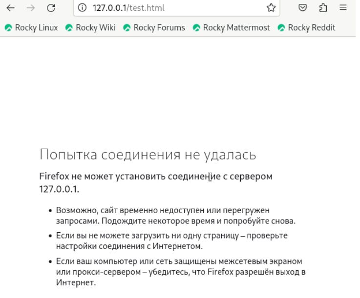

---
## Front matter
lang: ru-RU
title: Лабораторная работа №6
subtitle: Мандатное разграничение прав в Linux
author:
  - Чванова Ангелина Дмитриевна
institute:
  - Российский университет дружбы народов, Москва, Россия
date: 2024 год

babel-lang: russian
babel-otherlangs: english
mainfont: Arial
monofont: Courier New
fontsize: 12pt

## Formatting pdf
toc: false
toc-title: Содержание
slide_level: 2
aspectratio: 169
section-titles: true
theme: metropolis
header-includes:
 - \metroset{progressbar=frametitle,sectionpage=progressbar,numbering=fraction}
 - '\makeatletter'
 - '\beamer@ignorenonframefalse'
 - '\makeatother'
---
# Информация

## Докладчик

:::::::::::::: {.columns align=center}
::: {.column width="70%"}

  * Чванова Ангелина Дмитриевна
  * студент
  * Российский университет дружбы народов
  * [angelinachdm@gmail.com](mailto:angelinachdm@gmail.com)
  * <https://adchvanova-new.github.io/ru/>

:::
::: {.column width="30%"}


:::
::::::::::::::

# Цель работы

Развить навыки администрирования ОС Linux. Получить первое практическое знакомство с технологией SELinux1. Проверить работу SELinx на практике совместно с веб-сервером
Apache.

# Теоретическое введение

SELinux (Security-Enhanced Linux) — обеспечивает усиление защиты путем внесения изменений как на уровне ядра, так и на уровне пространства пользователя,
что превращает ее в действительно «непробиваемую» операционную систему. Впервые эта система появилась в четвертой версии CentOS, а в 5 и 6 версии
реализация была существенно дополнена и улучшена.

Apache — это свободное программное обеспечение, с помощью которого можно создать веб-сервер. Данный продукт возник как доработанная версия другого HTTP-клиента от национального центра суперкомпьютерных приложений (NCSA).

# Выполнение лабораторной работы

Для начала был выполен вход в систему под своей учетной записью. После чего необходимо было проверить, что SELinux работает в режиме enforcing политики targeted с помощью команд getenforce и sestatus

{#fig:001 width=70%}

# Выполнение лабораторной работы

Запускаем сервер apache, далее обращаемсь с помощью браузера к веб-серверу, запущенному на компьютере, он работает, что видно из вывода команды `service httpd status` 

{#fig:002 width=70%}

# Выполнение лабораторной работы

С помощью команды `ps auxZ | grep httpd` находим веб-сервер Apache в списке процессов. Его контекст безопасности - httpd_t

{#fig:003 width=70%}

# Выполнение лабораторной работы

Просмотрим текущее состояние переключателей SELinux для Apache с помощью команды `sestatus -bigrep httpd` 

{#fig:004 width=50%}

# Выполнение лабораторной работы

Просмотрим статистику по политике с помощью команды `seinfo`. Множество пользователей - 8, ролей - 39, типов - 5135. 

{#fig:005 width=43%}

# Выполнение лабораторной работы

Типы поддиректорий, находящихся в директории `/var/www`, с помощью команды `ls -lZ /var/www` следующие: владелец - root, права на изменения только у владельца. Файлов в директории нет

{#fig:006 width=43%}

# Выполнение лабораторной работы

В директории `/var/www/html` нет файлов.

{#fig:007 width=70%}


# Выполнение лабораторной работы

Создать файл может только суперпользователь, поэтому от его имени создаем файл touch.html cо следующим содержанием:
```html
<html>
<body>test</body>
</html>
```

{#fig:008 width=70%}

# Выполнение лабораторной работы

Проверяем контекст созданного файла. По умолчанию это httpd_sys_content_t 

{#fig:009 width=70%}

# Выполнение лабораторной работы

Проверяем контекст созданного файла. По умолчанию это httpd_sys_content_t 

{#fig:010 width=60%}

# Выполнение лабораторной работы

Обращаемся к файлу через веб-сервер, введя в браузере адрес http://127.0.0.1/test.html. Файл успешно отображается

{#fig:011 width=70%}

# Выполнение лабораторной работы

{#fig:012 width=60%}

# Выполнение лабораторной работы

Изменяем контекст файла на любой другой, к которому процесс httpd не
должен иметь доступа

{#fig:013 width=70%}

# Выполнение лабораторной работы

При попытке отображения файла в браузере получаем сообщение об ошибке

{#fig:014 width=70%}

# Выполнение лабораторной работы

файл не был отображён, хотя права доступа позволяют читать этот файл любому пользователю, потому что установлен контекст, к которому процесс httpd не должен иметь доступа.Просматриваем log-файлы веб-сервера Apache и системный лог-файл и если в системе окажутся запущенными процессы setroubleshootd и audtd, то также можно увидеть ошибки, аналогичные указанным выше, в файле /var/log/audit/audit.log.

{#fig:015 width=70%}

# Выполнение лабораторной работы

Чтобы запустить веб-сервер Apache на прослушивание ТСР-порта 81 (а не 80) открываем файл /etc/httpd/httpd.conf для изменения.

{#fig:016 width=70%}

# Выполнение лабораторной работы

Находим строчку Listen 80 и заменяем её на Listen 81. 

{#fig:017 width=50%}

# Выполнение лабораторной работы

После чего выполняем перезапуск веб-сервера Apache. Произошёл сбой, потому что порт 80 для локальной сети, а 81 нет

{#fig:018 width=43%}

# Выполнение лабораторной работы

{#fig:019 width=70%}

# Выполнение лабораторной работы

Запись появилась в файлу error_log

{#fig:020 width=50%}

# Выполнение лабораторной работы

Выполняем команду `semanage port -a -t http_port_t -р tcp 81` После этого проверяем список портов командой `semanage port -l | grep http_port_t`
Порт 81 появился в списке (рис. [-@fig:021]).

{#fig:021 width=70%}

# Выполнение лабораторной работы

Перезапускаем сервер Apache

{#fig:022 width=70%}

# Выполнение лабораторной работы

Теперь он работает, ведь порт 81 внечен в список портов `htttpd_port_t

{#fig:023 width=70%}

# Выполнение лабораторной работы

Возвращаем в файле /etc/httpd/httpd.conf порт 80, вместо 81. Проверяем, что порт 81 удален

{#fig:024 width=70%}

Далее чего удаляем файл test.html


# Выводы

В ходе выполнения данной лабораторной работы были развиты навыки администрирования ОС Linux, получено первое практическое знакомство с технологией SELinux и проверена работа SELinux на практике совместно с веб-сервером
Apache.

# Список литературы{.unnumbered}

[1] Документация по Virtual Box: https://www.virtualbox.org/wiki/Documentation

[2] Документация по Git: https://git-scm.com/book/ru/v2

[3] Документация по Markdown: https://learn.microsoft.com/ru-ru/contribute/markdown-reference


