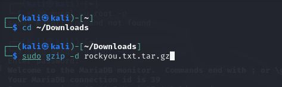
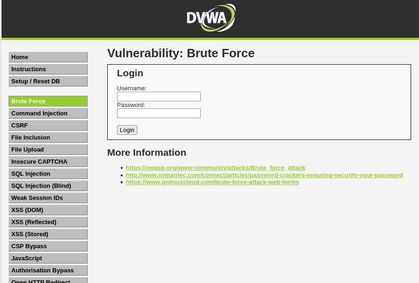
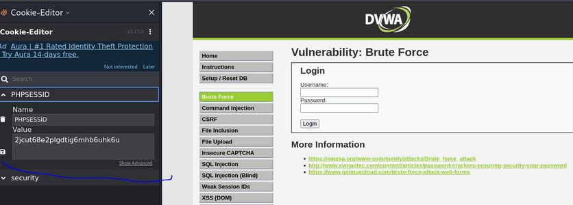
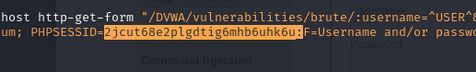
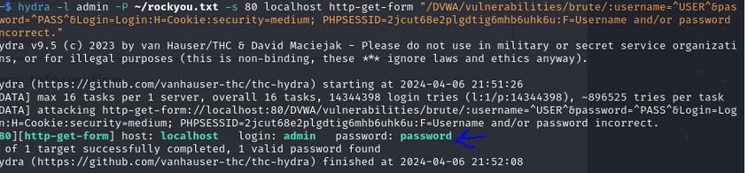
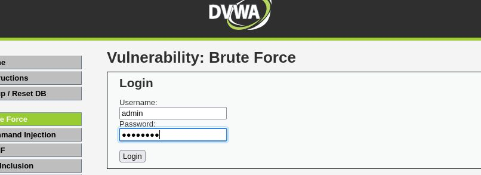
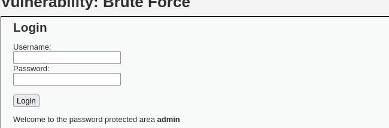

---
## Front matter
lang: ru-RU
title: Индивидуальный проект Этап №3
subtitle: Использование Hydra
author:
  - Чванова Ангелина Дмитриевна
institute:
  - Российский университет дружбы народов, Москва, Россия
date: 2024 год

babel-lang: russian
babel-otherlangs: english
mainfont: Arial
monofont: Courier New
fontsize: 12pt

## Formatting pdf
toc: false
toc-title: Содержание
slide_level: 2
aspectratio: 169
section-titles: true
theme: metropolis
header-includes:
 - \metroset{progressbar=frametitle,sectionpage=progressbar,numbering=fraction}
 - '\makeatletter'
 - '\beamer@ignorenonframefalse'
 - '\makeatother'
---
# Информация

## Докладчик

:::::::::::::: {.columns align=center}
::: {.column width="70%"}

  * Чванова Ангелина Дмитриевна
  * студент
  * Российский университет дружбы народов
  * [angelinachdm@gmail.com](mailto:angelinachdm@gmail.com)
  * <https://adchvanova-new.github.io/ru/>

:::
::: {.column width="30%"}

:::
::::::::::::::

# Цель работы

Приобретение практических навыков по использованию инструмента Hydra для брутфорса паролей.

## Задание

1. Необходимо реализовать эксплуатацию уязвимости с помощью брутфорса паролей.

# Теоретическое введение

- Hydra используется для подбора или взлома имени пользователя и пароля.
- Поддерживает подбор для большого набора приложений [@brute, @force, @parasram].

Исходные данные: IP сервера 178.72.90.181; Сервис http на стандартном 80 порту;

- Для авторизации используется html форма, которая отправляет по адресу http://178.72.90.181/cgi-bin/luci методом POST запрос вида username=root&password=test_password;

- В случае неудачной аутентификации пользователь наблюдает сообщение Invalid username and/or password! Please try again.

# Выполнение 

 Чтобы пробрутфорсить пароль, необходимо сначала найти большой список частоиспользуемых паролей. Его можно найти в открытых источниках, в рамках данного этапа был взят стандартный список паролей `rockyou.txt` для kali linux (рис. 1).

{#fig:001 width=70%}

# Выполнение 

Сайт DVWA, полученный в ходе предыдущего этапа проекта. Для запроса hydra нужны параметры cookie с этого сайта (рис. 2).
 
{#fig:002 width=50%}

# Выполнение 

Для того чтобы получить информацию о параметрах cookie я было установлено соответствующее расширение для браузера [@cookies], теперь можно не только посмотреть параметры cookie, но и скопировать их (рис. 3).

{#fig:003 width=70%}

# Выполнение

Hydra запрос с нужной информацией. Пароль будем подбирать для пользователя admin, используем GET-запрос с двумя параметрами cookie: безопасность и PHPSESSID, найденными в прошлом пункте (рис. 4).

{#fig:004 width=70%}

# Выполнение

Спустя некоторое время в результат запроса появится результат с подходящим паролем (рис. 5).

{#fig:005 width=70%}

# Выполнение

Полученные данные были введены на сайт для проверки (рис. 6).

{#fig:006 width=70%}

# Выполнение

Был получен положительный результат проверки пароля. Все сделано верно (рис. 7).

{#fig:007 width=70%}

# Выводы

Приобрела практические навыки по использованию инструмента Hydra для брутфорса паролей

# Список литературы{.unnumbered}

[1] Документация по Virtual Box: https://www.virtualbox.org/wiki/Documentation

