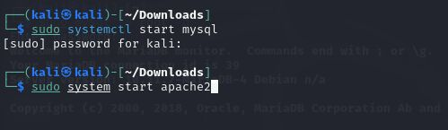
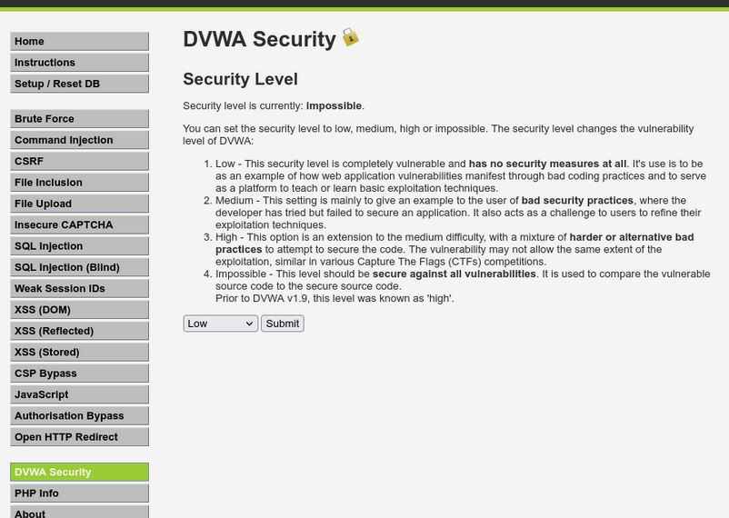
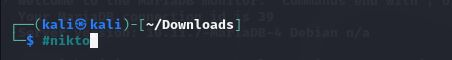
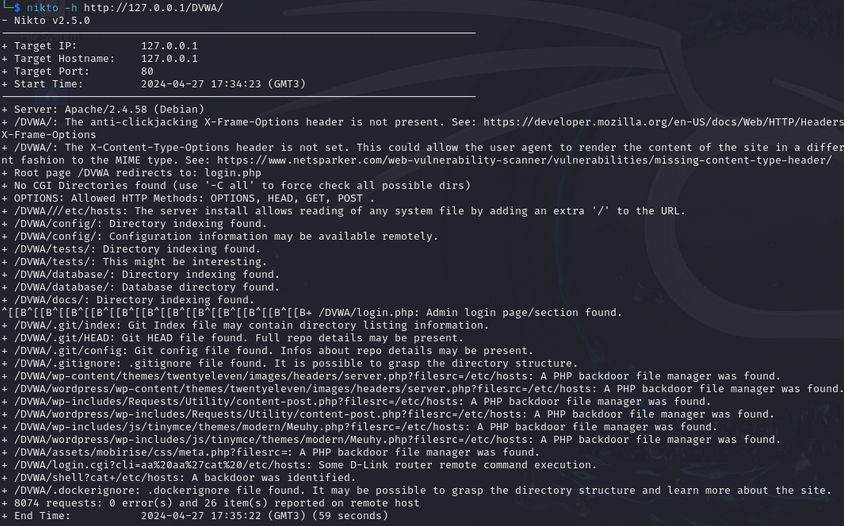
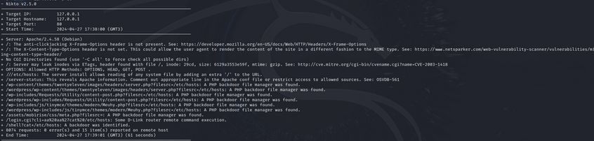

---
## Front matter
lang: ru-RU
title: Индивидуальный проект Этап №4
subtitle: Использование nikto
author:
  - Чванова Ангелина Дмитриевна
institute:
  - Российский университет дружбы народов, Москва, Россия
date: 2024 год

babel-lang: russian
babel-otherlangs: english
mainfont: Arial
monofont: Courier New
fontsize: 12pt

## Formatting pdf
toc: false
toc-title: Содержание
slide_level: 2
aspectratio: 169
section-titles: true
theme: metropolis
header-includes:
 - \metroset{progressbar=frametitle,sectionpage=progressbar,numbering=fraction}
 - '\makeatletter'
 - '\beamer@ignorenonframefalse'
 - '\makeatother'
---
# Информация

## Докладчик

:::::::::::::: {.columns align=center}
::: {.column width="70%"}

  * Чванова Ангелина Дмитриевна
  * студент
  * Российский университет дружбы народов
  * [angelinachdm@gmail.com](mailto:angelinachdm@gmail.com)
  * <https://adchvanova-new.github.io/ru/>

:::
::: {.column width="30%"}

:::
::::::::::::::

# Цель работы

Изучение сканера nikto и методов тестирования веб-приложений с помощью сканера nikto

## Задание

Использование nikto.

# Теоретическое введение

*nikto* — базовый сканер безопасности веб-сервера. Он сканирует и обнаруживает уязвимости в веб-приложениях, обычно вызванные неправильной конфигурацией на самом сервере, файлами, установленными по умолчанию, и небезопасными файлами, а также устаревшими серверными приложениями. Поскольку nikto построен исключительно на LibWhisker2, он сразу после установки поддерживает кросс-платформенное развертывание, SSL (криптографический протокол, который подразумевает более безопасную связь), методы аутентификации хоста (NTLM/Basic), прокси и несколько методов уклонения от идентификаторов. Он также поддерживает перечисление поддоменов, проверку безопасности приложений (XSS, SQL-инъекции и т. д.) и способен с помощью атаки паролей на основе словаря угадывать учетные данные авторизации. 

# Выполнение лабораторной работы

Для того чтобы работать с nikto, нужно подготовить веб-приложение, которое будем сканировать. В нащем случае было выбрано DVWA, для этого запускаем apache2

{#fig:001 width=70%}

# Выполнение лабораторной работы

В адресной строке браузера вводим адрес DVWA, перехожим в режим выбора уровня безопасности, ставим минимальный (nikto при обычном сканировании для режима impossible и low выдаст одинаковые потенциальные уязвимости, так как все уязвимости остаются, но изменяется сложность, с которой их можно использовать)

{#fig:002 width=50%}

# Выполнение лабораторной работы

Запускаем nikto

{#fig:003 width=70%}

# Выполнение лабораторной работы

Проверяем веб-приложение, введя его полный URL и не вводя порт 

{#fig:004 width=60%}

# Выполнение лабораторной работы

Затем сканируем, введя адрес хоста и адрес порта, результаты отличаются незначительно 

{#fig:005 width=60%}

# Анализ результатов сканирования

Кроме адреса хоста и порта веб-приложения, никто выводит инофрмацию о различных уязвимостях приложения:

Сервер: Apache/2.4.58 (Debian)
+ /DVWA/: Заголовок X-Frame-Options, защищающий от перехвата кликов, отсутствует. Смотрите: https://developer.mozilla.org/en-US/docs/Web/HTTP/Headers/X-Frame-Options

+ /DVWA/: Заголовок X-Content-Type-Options не задан. Это может позволить пользовательскому агенту отображать содержимое сайта способом, отличным от MIME-типа. Смотрите: https://www.netsparker.com/web-vulnerability-scanner/vulnerabilities/missing-content-type-header/

# Анализ результатов сканирования

+ /DVWA/config/: Информация о конфигурации может быть доступна удаленно.

+ /DVWA/tests/: Найдена индексация каталога.

+ /DVWA/tests/: Это может быть интересно.

+ /DVWA/database/: Найдена индексация каталога.

+ /DVWA/база данных/: Найден каталог базы данных.

+ /DVWA/документы/: Найдена индексация каталога.

+ /DVWA/login.php: Найдена страница входа администратора/раздел.

# Анализ результатов сканирования

+ /DVWA/.git/index: Индексный файл Git может содержать информацию о списке каталогов.

+ /DVWA/.git/HEAD: Найден файл Git HEAD. Может содержаться полная информация о репозитории.

+ /DVWA/.git/config: Найден конфигурационный файл Git. Может содержаться информация о деталях репозитория.

+ /DVWA/.gitignore: найден файл .gitignore. Можно разобраться в структуре каталогов.

+ /DVWA/wp-content/themes/twentyeleven/images/headers/server.php?filesrc=/etc/hosts: Обнаружен файловый менеджер с бэкдором на PHP.

# Анализ результатов сканирования

Бэкдор, тайный вход (от англ. back door — «чёрный ход», «лазейка», буквально «задняя дверь») — дефект алгоритма, который намеренно встраивается в него разработчиком и позволяет получить несанкционированный доступ к данным. Также в результатах nikto отображает код OSVDB 561 и дает ссылку на CVE-2003-1418. OSVDB — это аббревиатура
базы данных уязвимостей с открытым исходным кодом.

- Заголовок ETag, который раскрывает номер вode.

- Многочастную границу MIME, которая раскрывает идентификаторы дочерних процессов (PID).

# Выводы

В рамках выполнения этапа индивидуального проекта был изучен и использован сканер nikto для тестирования веб-приложений

# Список литературы{.unnumbered}

[1] Документация по Virtual Box: https://www.virtualbox.org/wiki/Documentation