---
## Front matter
lang: ru-RU
title: Индивидуальный проект Этап №5
subtitle: Использование Burp Suite
author:
  - Чванова Ангелина Дмитриевна
institute:
  - Российский университет дружбы народов, Москва, Россия
date: 2024 год

babel-lang: russian
babel-otherlangs: english
mainfont: Arial
monofont: Courier New
fontsize: 12pt

## Formatting pdf
toc: false
toc-title: Содержание
slide_level: 2
aspectratio: 169
section-titles: true
theme: metropolis
header-includes:
 - \metroset{progressbar=frametitle,sectionpage=progressbar,numbering=fraction}
 - '\makeatletter'
 - '\beamer@ignorenonframefalse'
 - '\makeatother'
---
# Информация

## Докладчик

:::::::::::::: {.columns align=center}
::: {.column width="70%"}

  * Чванова Ангелина Дмитриевна
  * студент
  * Российский университет дружбы народов
  * [angelinachdm@gmail.com](mailto:angelinachdm@gmail.com)
  * <https://adchvanova-new.github.io/ru/>

:::
::: {.column width="30%"}

:::
::::::::::::::

# Цель работы

Научиться использовать Burp Suite.

# Теоретическое введение

Burp Suite представляет собой набор мощных инструментов безопасности веб-приложений, которые демонстрируют реальные возможности злоумышленника, проникающего в веб-приложения. Эти инструменты позволяют сканировать, анализировать и использовать веб-приложения с помощью ручных и автоматических методов. Интеграция интерфейсов этих инструментов обеспечивает полную платформу атаки для обмена информацией между одним или несколькими инструментами, что делает Burp Suite очень эффективной и простой в использовании платформой для атаки веб-приложений.

# Выполнение лабораторной работы

Запускаем локальный сервер, на котором необходимо открыть веб-приложение DVWA для тестирования инструмента Burp Suite

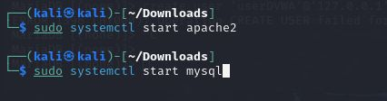{#fig:001 width=70%}

# Выполнение лабораторной работы

Запускаем инструмент Burp Suite

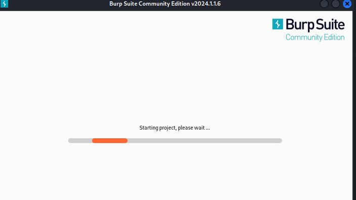{#fig:002 width=60%}

# Выполнение лабораторной работы

Открываем сетевые настройки браузера для подготовки к работе

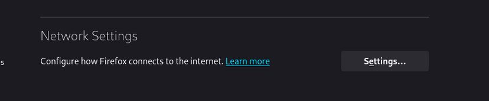{#fig:003 width=70%}

# Выполнение лабораторной работы

Изменение настроек сервера для работы с proxy и захватом данных с помощью Burp Suite 

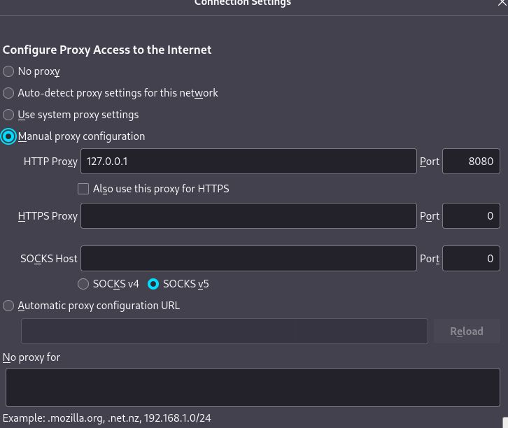{#fig:004 width=50%}

# Выполнение лабораторной работы

Изменяем настройки Proxy инструмента Burp Suite 

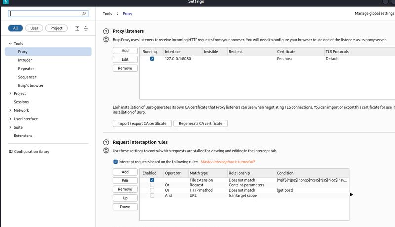{#fig:005 width=60%}

# Выполнение лабораторной работы

Устанавливаем значение "Intercept is on" во вкладке Proxy 

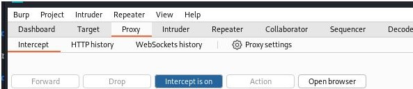{#fig:006 width=70%}

# Выполнение лабораторной работы

Чтобы Burp Suite исправно работал с локальным сервером, необходимо установить параметр `network_allow_hijacking_loacalhost` на `true` 

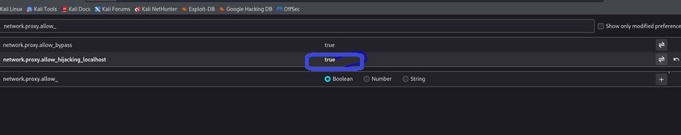{#fig:007 width=70%}

# Выполнение лабораторной работы

При входе в браузер на DVWA, во вкладки Proxy появляется захваченный запрос. Нажимаем "Forward", чтобы загрузить страницу

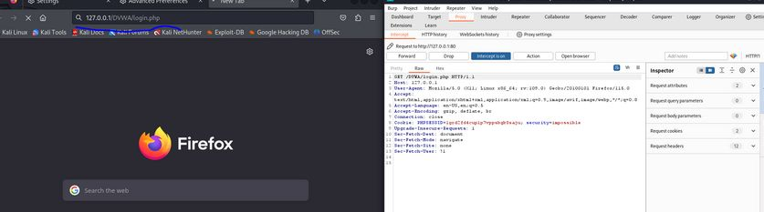{#fig:008 width=70%}

# Выполнение лабораторной работы

Загружаем страницу авторизации, текст запроса поменялся 

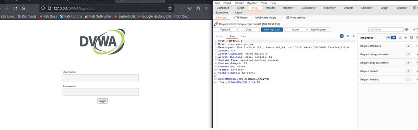{#fig:009 width=70%}

# Выполнение лабораторной работы

История запросов хранится во вкладке Target 

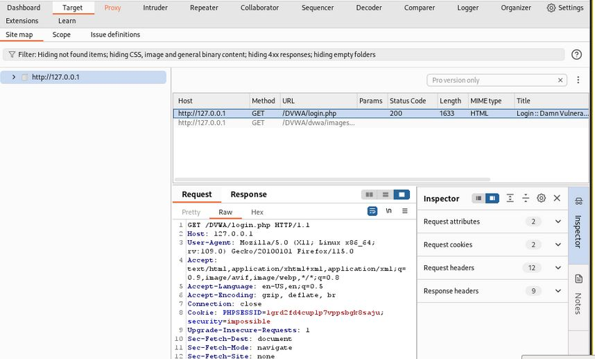{#fig:010 width=60%}

# Выполнение лабораторной работы

Попробуем ввести неправильные, случайные данные в веб-приложении и нажмем `Login`. В запросе увидим строку, в которой отображаются введенные нами данные, то есть поле для ввода 

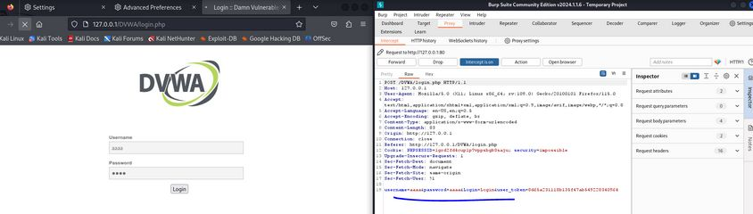{#fig:011 width=70%}

# Выполнение лабораторной работы

Этот запрос так же можно найти во вкладке Target, там же жмем правой кнопкой мыши на хост нужного запроса, и далее нажимаем "Send to Intruder" 

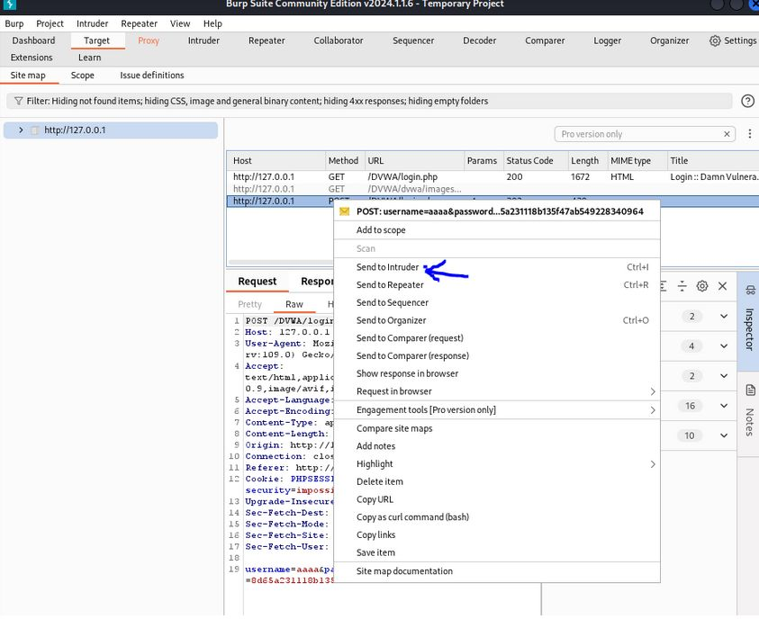{#fig:012 width=50%}

# Выполнение лабораторной работы

На вкладке Intruder видим значения по умолчанию у типа атаки и наш запрос 

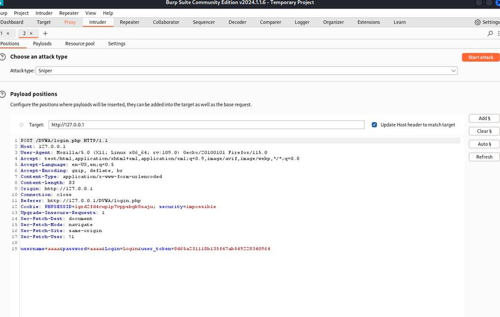{#fig:013 width=57%}

# Выполнение лабораторной работы

Изменяем значение типа атаки на Cluster bomb и проставляем специальные символы у тех данных в форме для ввода, которые будем пробивать, то есть у имени пользователя и пароля 

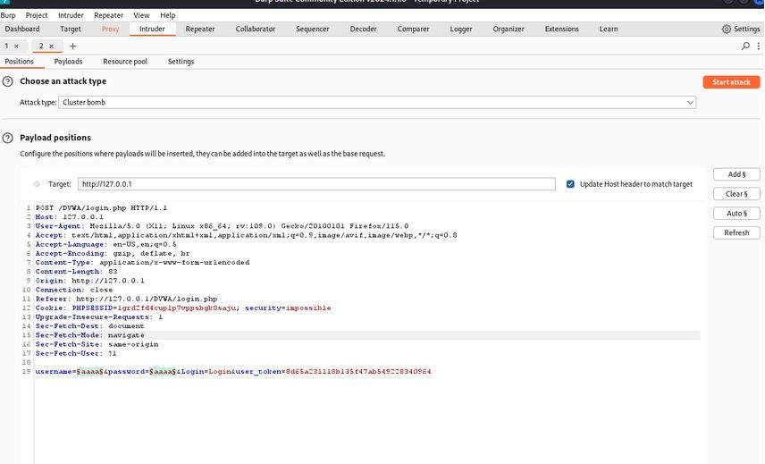{#fig:014 width=50%}

# Выполнение лабораторной работы

Так как мы отметили 2 параметра для подбора, то нам необходимо 2 списка со значениями для подбора. Заполняем первый список в `Payload setting` 

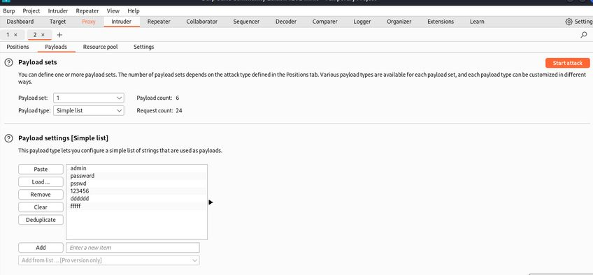{#fig:015 width=70%}

# Выполнение лабораторной работы

Заполняем значениями второй список. В строке request count видим нужное количество запросов, чтобы проверить все возможные пары пользователь-пароль 

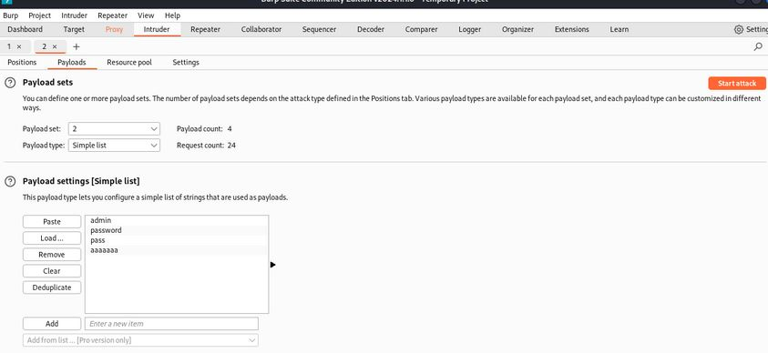{#fig:016 width=70%}

# Выполнение лабораторной работы

Запускаем атаку и начинаем подбор

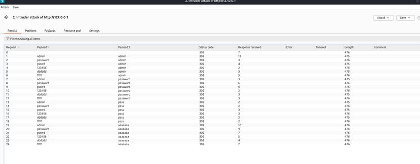{#fig:017 width=70%}

# Выполнение лабораторной работы

При открытии результата каждого post-запроса можно увидеть полученный get-запрос, в нем видно, куда нас перенаправило после выполнения ввода пары пользователь-пароль. admin-admin нас перенаправило на login.php, это значит, что пара не подходит 

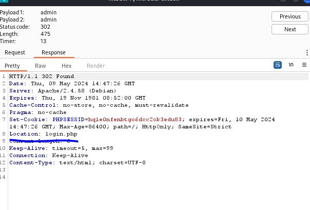{#fig:018 width=57%}

# Выполнение лабораторной работы

Проверим результат пары admin-password во вкладке Response, теперь нас перенаправляет на страницу index.php, значит пара должна быть верной 

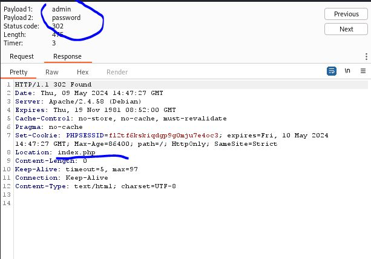{#fig:019 width=60%}

# Выполнение лабораторной работы

Дополнительная проверка с использованием Repeater, нажимаем на нужный нам запрос правой кнопкой мыши и жмем "Send to Repeater" 

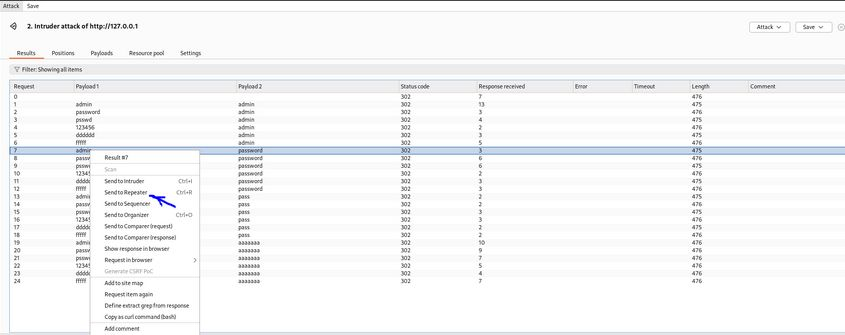{#fig:020 width=70%}

# Выполнение лабораторной работы

Переходим во вкладку "Repeater" 

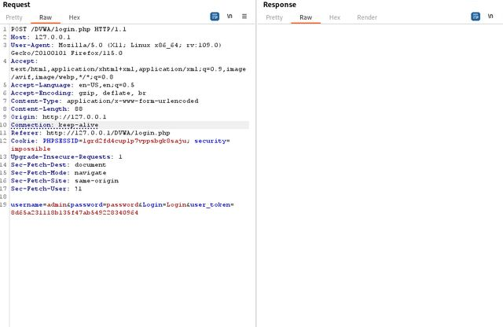{#fig:021 width=60%}

# Выполнение лабораторной работы

Нажимаем "send", получаем в Response в результат перенаправление на index.php 

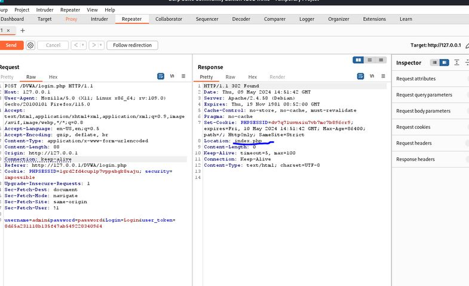{#fig:022 width=60%}

# Выполнение лабораторной работы

После нажатия на `Follow redirection`, получим нескомпилированный html код в окне Response

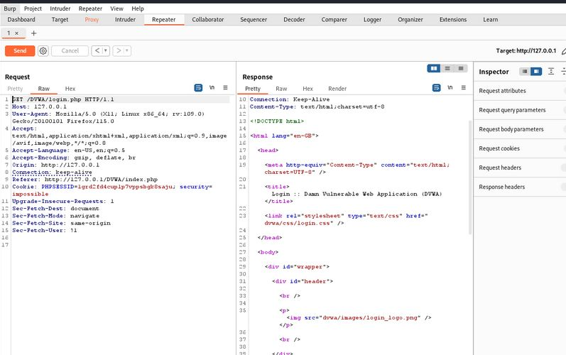{#fig:023 width=60%}

# Выполнение лабораторной работы

Далее в подокне Render получим то, как выглядит полученная страница 

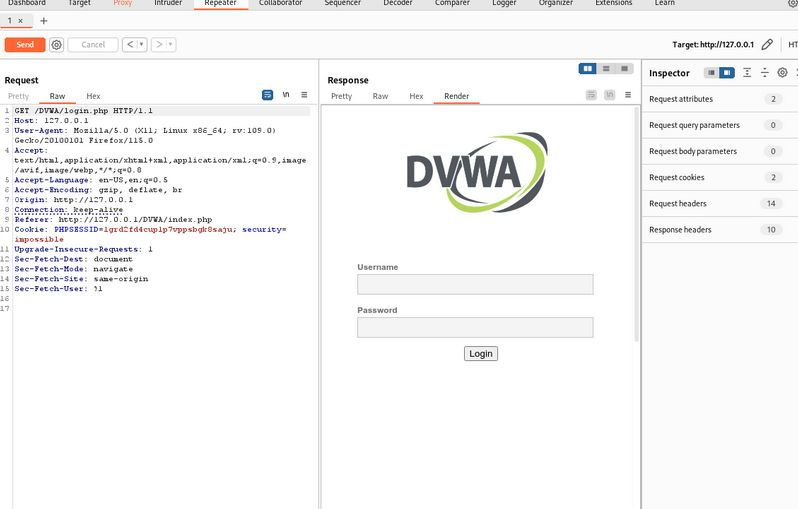{#fig:024 width=60%}

# Выводы

При выполнении лабораторной работы научилась использовать инструмент Burp Suite.

# Список литературы{.unnumbered}

[1] Документация по Virtual Box: https://www.virtualbox.org/wiki/Documentation

[2] Парасрам, Ш. Kali Linux: Тестирование на проникновение и безопасность : Для профессионалов. Kali Linux / Ш. Парасрам, А. Замм, Т. Хериянто, и др. – Санкт-Петербург : Питер, 2022. – 448 сс
